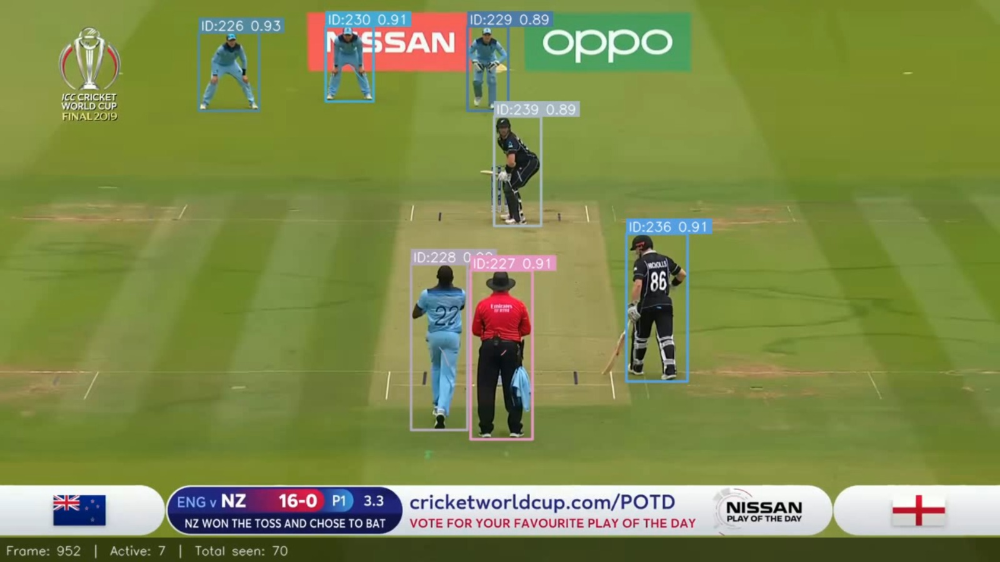
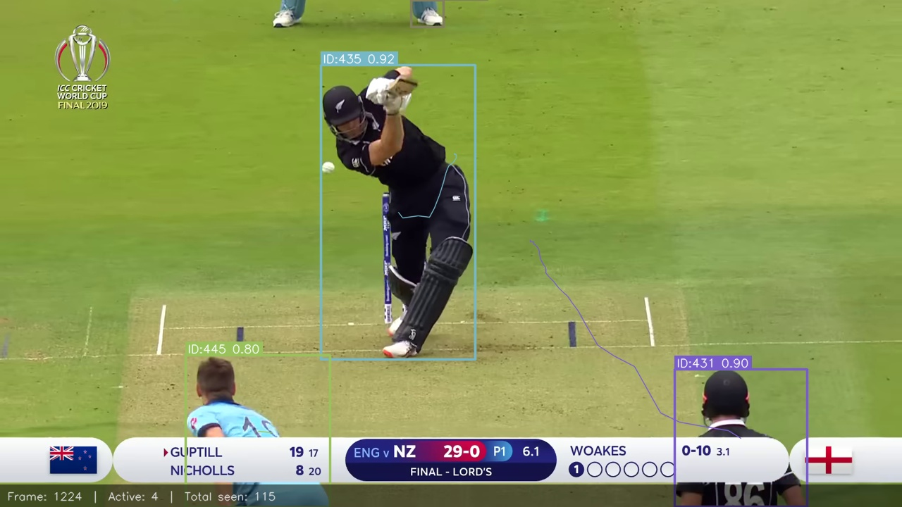
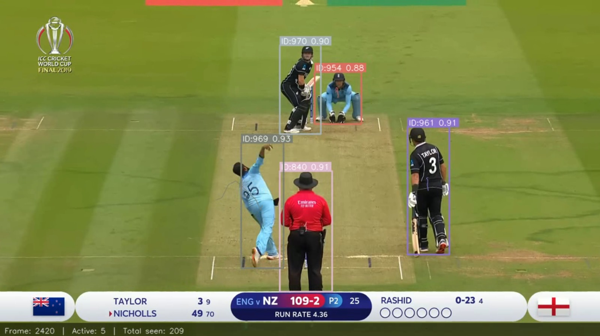

# Multi-Object Detection and Persistent ID Tracking 

A production-style computer vision pipeline for detecting multiple subjects in public sports/event footage and assigning stable IDs across time. Built for applied AI / Computer Vision evaluation using cricket broadcast footage.

## Highlights

* YOLOv8 person detection
* ByteTrack persistent multi-object tracking
* Stable track IDs with motion trails
* Audience suppression via ROI + size filtering
* Annotated MP4 output video
* JSON tracking logs
* Analytics visualizations (heatmap, trajectories, counts, speed stats)
* Model benchmarking: YOLOv8n / YOLOv8s / YOLOv8m

## Demo Outputs

### Annotated Tracking Frames






### Project Overview

This project implements an end-to-end computer vision pipeline for multi-object detection and persistent identity tracking in publicly available sports footage. The selected use case is a cricket broadcast video. The system detects relevant on-field participants (players and officials), assigns consistent IDs across frames, and produces an annotated output video with bounding boxes, track IDs, motion trails, and analytics visualizations.

### Key Features

* YOLOv8-based person detection
* ByteTrack multi-object tracking with persistent IDs
* Crowd suppression using region-of-interest and size filtering
* Annotated output video generation
* Per-frame tracking log export (JSON)
* Screenshots from representative frames
* Optional analytics:

  * movement heatmap
  * trajectory visualization
  * object count over time
  * speed estimation
  * model comparison (YOLOv8n / YOLOv8s / YOLOv8m)

### Project Structure

```text
MOD_Tracker/
├── tracker.py
├── annotator.py
├── download_video.py
├── visualisation.py
├── requirements.txt
├── input_video.mp4
├── outputs/
│   ├── output_annotated.mp4
│   ├── tracks.json
│   ├── screenshots/
│   └── visualisation/
└── README.md
```

### Dependencies

Install Python 3.10+ and run:

```bash
pip install -r requirements.txt
```


### Installation Steps

1. Clone the repository.
2. Create a virtual environment.
3. Activate the environment.
4. Install dependencies.
5. Place a public sports video as `input_video.mp4` or use the downloader script.

Example:

```bash
python -m venv MOD.venv
MOD.venv\Scripts\activate
pip install -r requirements.txt
```

### Download Public Video

```bash
python download_video.py
```

Or provide a custom URL:

```bash
python download_video.py --url "<video_url>" --out input_video.mp4
```

### How to Run the Pipeline

#### Main Tracking Pipeline

```bash
python tracker.py
```

Outputs:

* `outputs/output_annotated.mp4`
* `outputs/tracks.json`
* `outputs/screenshots/`

#### Analytics / Optional Enhancements

```bash
python visualisation.py
```

Outputs generated in:

* `outputs/visualisation/`

### Model / Tracker Choices

#### Detector: YOLOv8

YOLOv8 was selected because it provides strong real-time detection performance, easy deployment, multiple model sizes (n/s/m), and robust small-object performance.

Final default model used:

* `yolov8s`

#### Tracker: ByteTrack

ByteTrack was selected because it is efficient, robust to missed detections, and maintains stable IDs in crowded scenes better than simpler IoU-only trackers.

### Assumptions Taken

* Relevant subjects are active on-field participants (players, umpires), not spectators.
* Broadcast camera angles contain enough visibility for person detection.
* Video FPS metadata is approximately correct.
* Pixel-to-meter conversion for speed estimation is approximate.
* The selected public video is legally accessible for academic evaluation.

### Limitations

* Close-up shots may introduce false detections.
* Heavy occlusion can temporarily break identity continuity.
* Broadcast camera cuts reduce tracking continuity.
* Speed estimation is approximate without exact calibration.
* Ball tracking is not optimized in the current final pipeline.

### Possible Improvements

* Re-identification embedding model for stronger ID recovery
* Camera cut detection and track reset logic
* Sports-specific fine-tuned detector
* Better homography calibration for accurate speed metrics
* Ball trajectory modeling
* Team classification using jersey segmentation

### Public Video Source

[Public video link used for testing here.](https://www.youtube.com/watch?v=Kwu1yIC-ssg)

---

